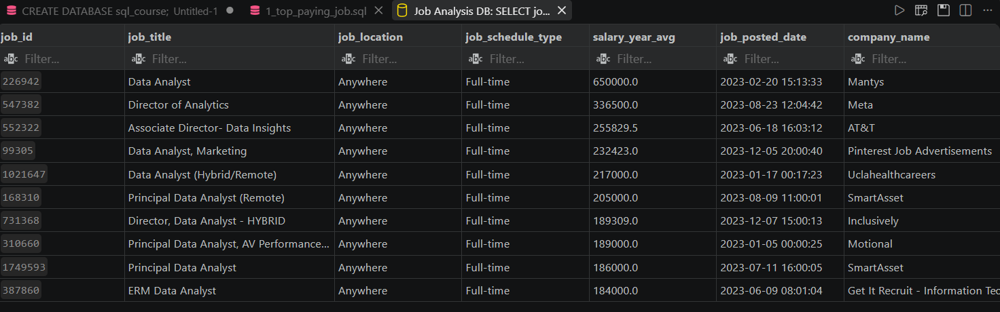
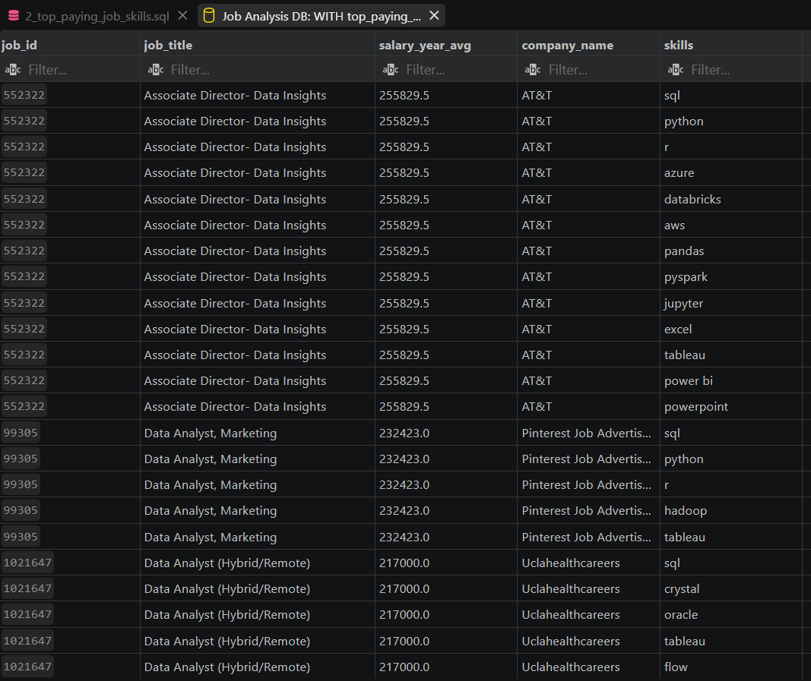
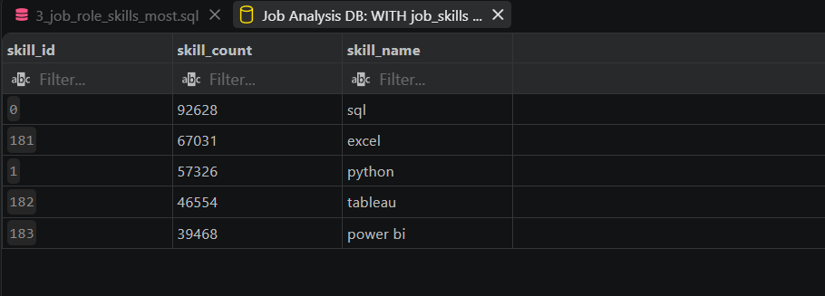
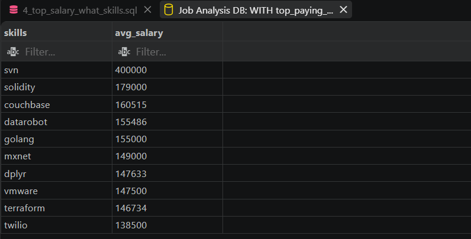
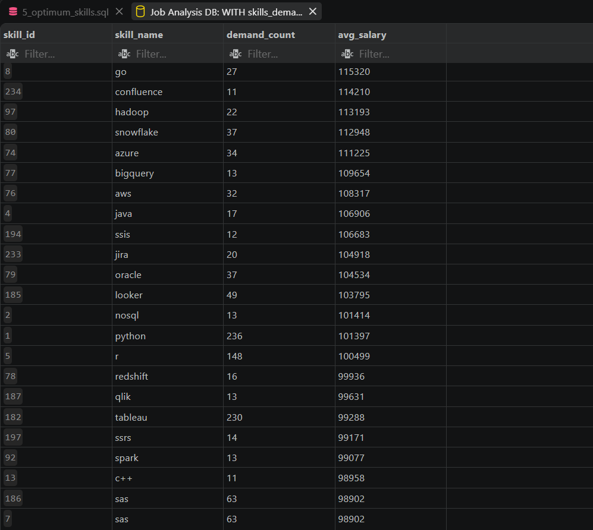

# 📊 Data Analyst Job Market & Salary SQL Analysis

## 📌 Overview
This project provides a comprehensive analysis of the Data Analyst job market using SQL. By analyzing salary data, required skill sets, demand trends, and remote work offerings, this project aims to help data professionals identify high-paying opportunities and high-value skills to learn.

---

## 🔍 Key Questions & SQL Solutions

### 1. What are the top-paying Data Analyst jobs?
Identifies the top 10 highest-paying remote Data Analyst roles with specified yearly average salaries.

* **SQL Query:** [`sql_queries/1_top_paying_jobs.sql`](./sql_queries/1_top_paying_jobs.sql)

#### Output Result:

---

### 2. What skills are required for the top-paying Data Analyst jobs?
Joins skill mapping data to extract specific technical skills requested by companies offering top-tier Data Analyst compensation.

* **SQL Query:** [`sql_queries/2_top_paying_job_skills.sql`](./sql_queries/2_top_paying_job_skills.sql)

#### Output Result:

---

### 3. What are the most in-demand skills for Data Analysts?
Calculates the top 5 most frequently requested skills in Data Analyst job postings across the entire dataset.

* **SQL Query:** [`sql_queries/3_top_demanded_skills.sql`](./sql_queries/3_top_demanded_skills.sql)

#### Output Result:

---

### 4. What are the top skills based on average salary?
Analyzes which individual technical skills are associated with the highest average yearly salaries.

* **SQL Query:** [`sql_queries/4_top_paying_skills.sql`](./sql_queries/4_top_paying_skills.sql)

#### Output Result:

---

### 5. What are the most optimal skills to learn? (High Demand & High Pay)
Combines demand counts with average salary statistics using Common Table Expressions (CTEs) to highlight the high-demand, high-paying skills for remote Data Analyst positions.

* **SQL Query:** [`sql_queries/5_optimal_skills.sql`](./sql_queries/5_optimal_skills.sql)

#### Output Result:

---

## 🛠️ Tools Used
* **SQL / PostgreSQL:** CTEs, Aggregations (`COUNT`, `AVG`, `ROUND`), Inner/Left Joins, Filtering (`WHERE`, `HAVING`), Sorting (`ORDER BY`), and Window Functions.
* **VS Code:** Code editing, file management, and Git integration.
* **GitHub:** Version control and portfolio hosting.